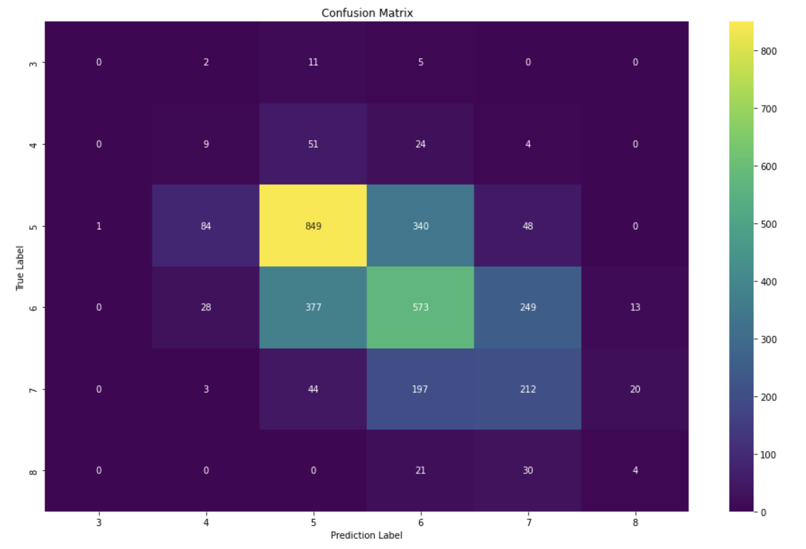

# Wine-Quality-Prediction
Kaggle Competition to predict quality of wine judged by quadratic weighted kappa metric.

# Code and Resources used:

* **Python version:** 3.7
* **Packages:** pandas, numpy, matplotlib, seaborn, plotly, sklearn, statsmodels
* **Dataset link:** https://www.kaggle.com/competitions/playground-series-s3e5/overview

# Overview:

The dataset for this competition (both train and test) was generated from a deep learning model trained on the Wine Quality dataset. Feature distributions are close to, but not exactly the same, as the original. The project aimed at predicting quality of wines considering several independent variables.

# Models:

LightGBM regressor and classifier were applied to the dataset. LightGBM regressor scored higher than classifier with a quadratic weighted kappa score of **0.56474**. Cross validation technique was applied to fine tune the model.

# Results:
Following is the confusion matrix that was calculated after the application of final model.

 

